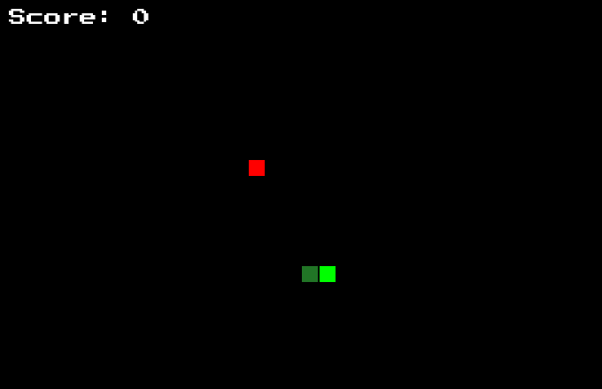
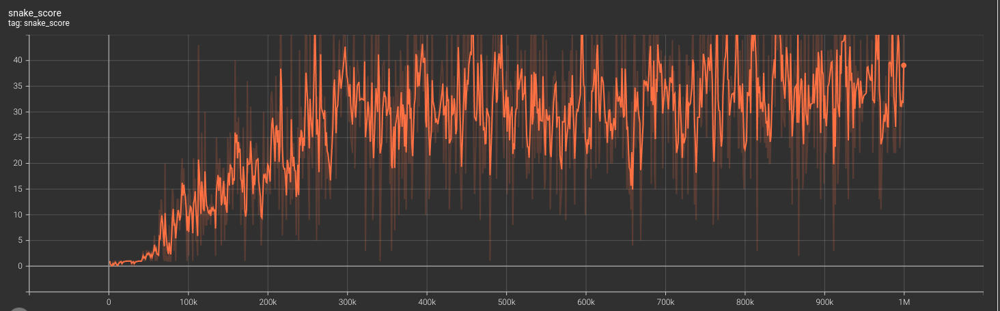

# 🐍PySnake - RL playing Snake



## Overview
This project applies Reinforcement Learning to train an AI agent to play Snake using Proximal Policy Optimization. The model learns to maximize its score by optimizing movement strategies while avoiding collisions.

A custom Gym environment is built for training, and PyGame is used for visualization. Additionally, the project includes performance tracking, log analysis with TensorBoard, and GIF export to illustrate the AI’s progress.

## Training logs and visualizations
The training process logs detailed metrics, which can be visualized using TensorBoard. These logs are saved in the `logs/` directory and include:

- **Episode Rewards** – Tracks how well the AI performs over time
- **Loss & Policy Entropy** – Monitors learning stability and exploration
- **Value Function Estimates** – Shows how well the agent predicts future rewards

To visualize the logs, simply run:

```
tensorboard --logdir=logs/
```

## Training performance
The graph below shows the snake’s length over time, demonstrating performance improvements as the model refines its strategy.



## Setup & installation

1. Install dependencies with:
    ```
    pip install -r requirements.txt
    ```

2. Train your own PPO agent or use already trained one in `models/`:
    ```
    python ppo_train.py
    ```

    In case you train your own model, its' logs will be available in `logs/ppo/`.

3. Visualize the Agent playing the game with:
    ```
    python vis_agent.py
    ```

    set `SAVE_FRAMES = True` if you want to save game frames. They will be saved to `frames/`. Then you can run:
    ```
    python make_gif.py
    ```

    To generate a gif out of those frames.

4. (Optional) You can play the game yourself with:
    ```
    python play.py
    ```
    Press arrow keys to change directions, ESC to end the game.

## License
This project is open-source under the MIT License.